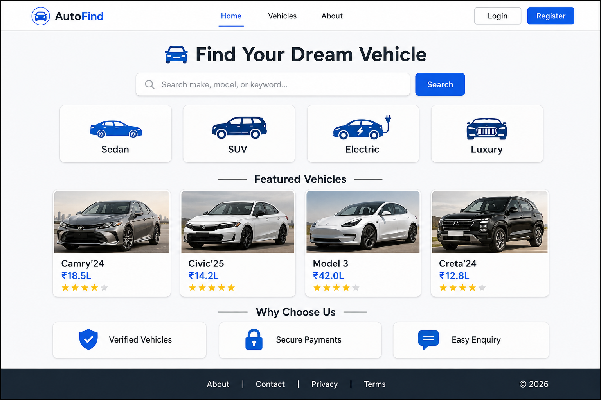
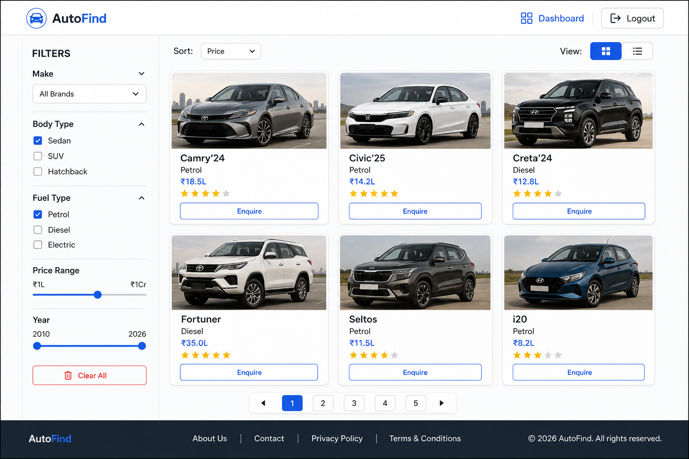
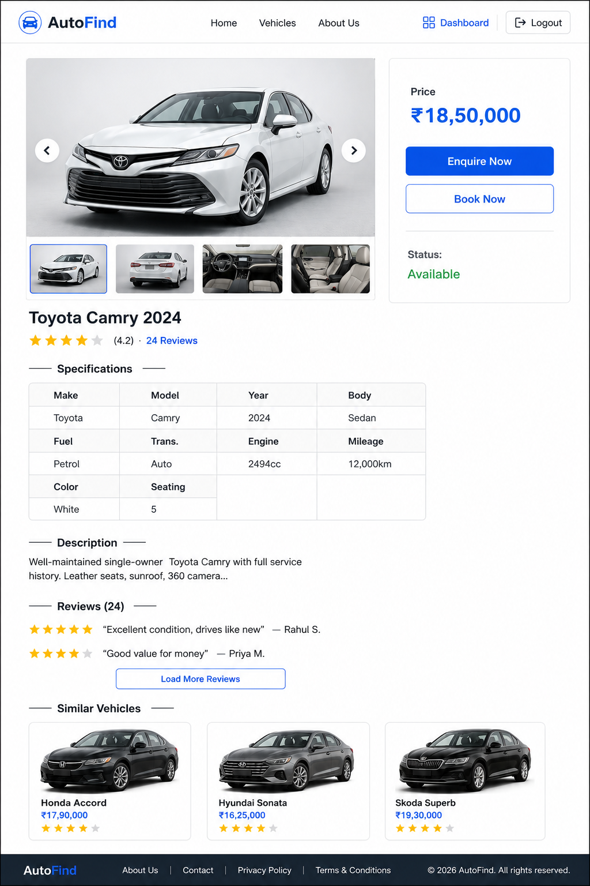
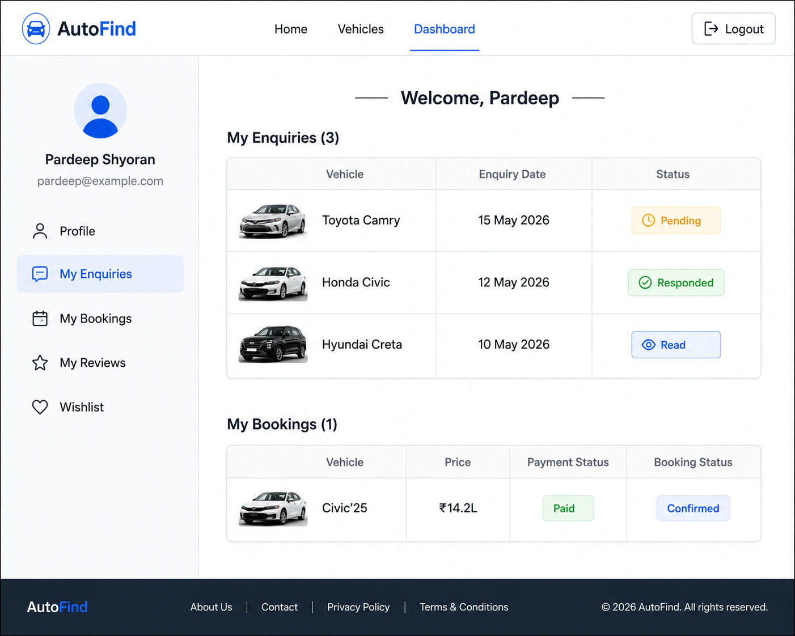
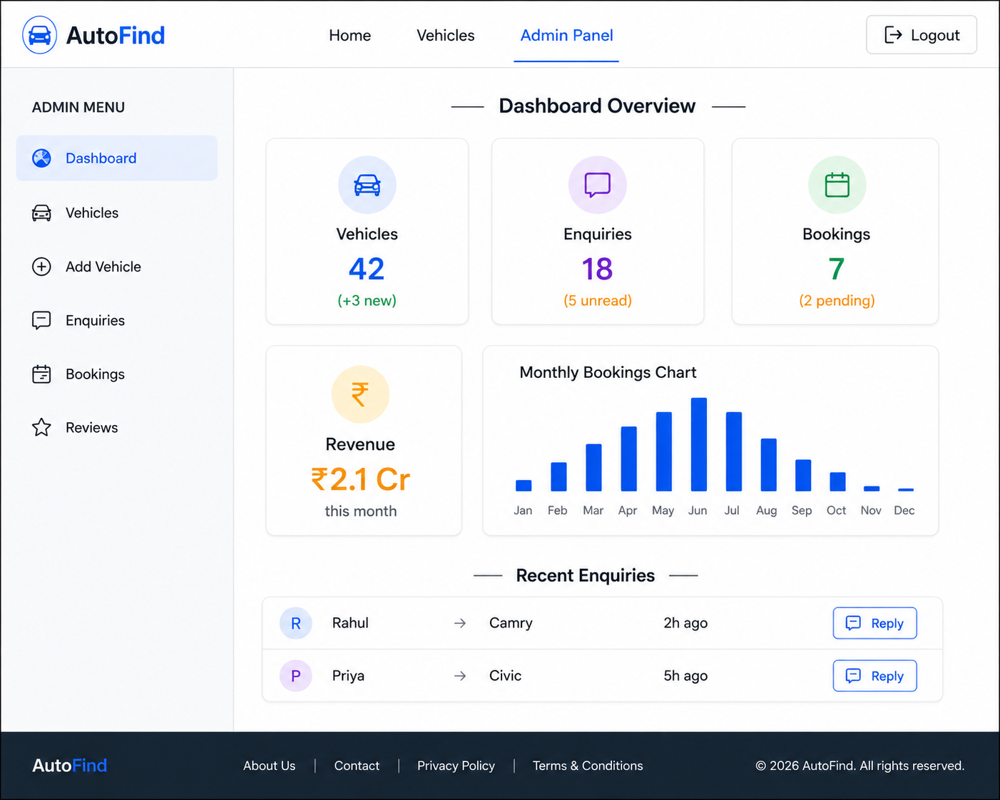
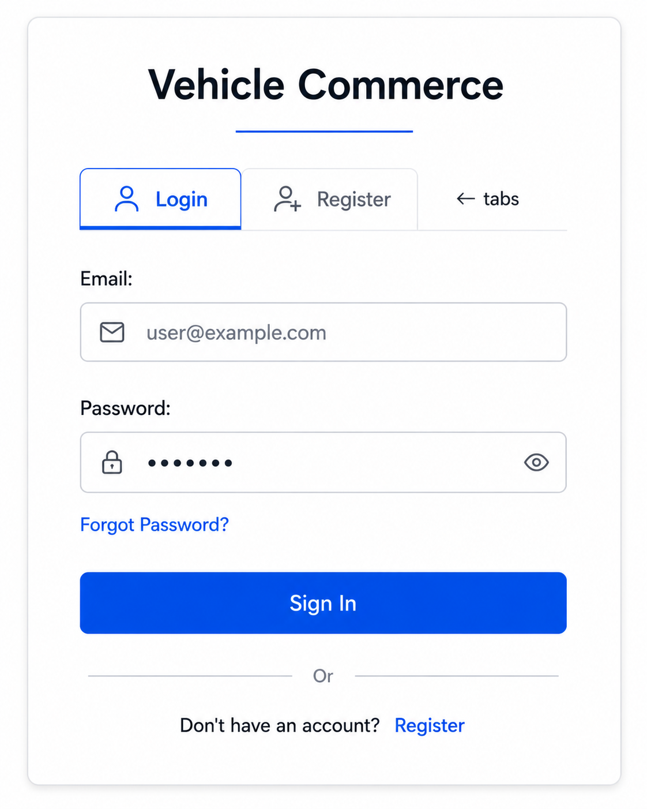

# Vehicle Commerce — Product Features & Prototype

A professional full-stack MERN (MongoDB, Express, React, Node.js) web application for vehicle commerce. The platform enables administrators to register, manage, and showcase vehicles while allowing users to browse, enquire about, and purchase vehicles seamlessly.


---
 
## Table of Contents
 
1. [Project Overview](#project-overview)
2. [Tech Stack](#tech-stack)
3. [Design System — Color Scheme & Font Usage](#design-system--color-scheme--font-usage)
4. [Repository Structure](#repository-structure)
5. [User Roles & Permissions](#user-roles--permissions)
6. [Core Features](#core-features)
   - [Authentication & Authorization](#1-authentication--authorization)
   - [Admin Panel](#2-admin-panel)
   - [Vehicle Catalog](#3-vehicle-catalog)
   - [Vehicle Detail Page](#4-vehicle-detail-page)
   - [Search & Filters](#5-search--filters)
   - [Enquiry System](#6-enquiry-system)
   - [Purchase / Booking Flow](#7-purchase--booking-flow)
   - [User Dashboard](#8-user-dashboard)
   - [Notifications](#9-notifications)
   - [Reviews & Ratings](#10-reviews--ratings)
7. [Database Schema Design](#database-schema-design)
8. [API Endpoints](#api-endpoints)
9. [Product Prototype — Screen-by-Screen](#product-prototype--screen-by-screen)
10. [Non-Functional Requirements](#non-functional-requirements)
11. [Future Enhancements](#future-enhancements)
 

---

## Project Overview

**Vehicle Commerce** is a car marketplace application where:

- **Admin** registers vehicles with complete details (images, specifications, pricing) and manages the inventory.
- **Users** browse the catalog, filter by various criteria, view detailed vehicle pages, submit enquiries, and initiate purchases or bookings.

The application follows a monorepo structure with separate `Backend` and `Frontend` directories.

---


### Color Palette Reference
 
| Variable | Dark Mode | Light Mode | Purpose |
| -------- | --------- | ---------- | ------- |
| `--primary-color` | `#ff3c00` | `#ff3c00` | Buttons, CTAs, active states, links |
| `--secondary-color` | `#161616` | `#161616` | Card backgrounds, secondary surfaces |
| `--background-color` | `#0a0a0a` | `#fafafa` | Page background |
| `--text-color` | `#f5f5f5` | `#0a0a0a` | Primary text |
| `--text-color2` | `#ff3c00` | `#ff3c00` | Accent text, highlights, prices |
| `--text-color3` | `#3d3d3d` | `#a0a0a0` | Muted secondary text |
| `--text-color4` | `#505050` | `#8a8a8a` | Placeholders, disabled states |
| `--text-color5` | `#c8c8c8` | `#4a4a4a` | Labels, captions |
| `--border-color` | `#1a1a1a` | `#ebebeb` | Dividers, card borders |
 
### Font Usage Guide
 
| Font | Variable | Where to Use |
| ---- | -------- | ------------ |
| **Antonio** | `--font-family1` | Hero headlines, vehicle names (bold, condensed) |
| **Montserrat** | `--font-family3` | Section headings, navigation |
| **Onest** | `--font-family4` | Body text, descriptions (default font) |
| **Poppins** | `--font-family7` | Buttons, labels, form inputs |
| **Syne** | `--font-family6` | Special callouts, taglines |
| **Yellowtail** | `--font-family8` | Decorative accents, cursive highlights |
| **Roboto** | `--font-family5` | Data tables, specs, numbers |
 
---

## Tech Stack

| Layer          | Technology                                                                 |
| -------------- | -------------------------------------------------------------------------- |
| **Frontend**   | React 18, Vite, React Router v6, CSS Modules, Redux Toolkit, Axios, React Hook Form, React Toastify, Swiper.js (image carousel) |
| **Backend**    | Node.js, Express.js, Mongoose, JWT (access + refresh tokens), Multer (file uploads), Cloudinary (image hosting), Morgan, CORS, cookie-parser |
| **Database**   | MongoDB Atlas                                                              |
| **Payments**   | Razorpay / Stripe (integration-ready)                                      |
| **Email**      | Nodemailer with SMTP (enquiry confirmations, booking receipts)             |
| **Deployment** | Vercel (Frontend), Render / Railway (Backend), MongoDB Atlas (Database)    |

---

## Repository Structure

```text
Vehicle_Commerce/
├── Backend/
│   ├── package.json
│   ├── server.js
│   └── src/
│       ├── app.js                     # Express app setup & middleware
│       ├── config/
│       │   ├── config.js              # Environment variables
│       │   ├── database.js            # MongoDB connection
│       │   └── cloudinary.js          # Cloudinary configuration
│       ├── controllers/
│       │   ├── auth.controller.js     # Register, login, logout, refresh
│       │   ├── vehicle.controller.js  # CRUD operations for vehicles
│       │   ├── enquiry.controller.js  # Enquiry submission & management
│       │   ├── booking.controller.js  # Purchase / booking flow
│       │   └── review.controller.js   # Vehicle reviews & ratings
│       ├── middlewares/
│       │   ├── auth.middleware.js      # JWT verification & role guard
│       │   ├── upload.middleware.js    # Multer file upload handling
│       │   └── error.middleware.js     # Global error handler
│       ├── models/
│       │   ├── user.model.js
│       │   ├── vehicle.model.js
│       │   ├── enquiry.model.js
│       │   ├── booking.model.js
│       │   └── review.model.js
│       ├── routes/
│       │   ├── auth.routes.js
│       │   ├── vehicle.routes.js
│       │   ├── enquiry.routes.js
│       │   ├── booking.routes.js
│       │   └── review.routes.js
│       └── utils/
│           ├── sendEmail.js           # Nodemailer helper
│           ├── ApiError.js            # Custom error class
│           └── ApiResponse.js         # Standard response formatter
│
├── Frontend/
│   ├── package.json
│   ├── vite.config.js
│   ├── index.html
│   └── src/
│       ├── App.jsx
│       ├── main.jsx
│       ├── api/
│       │   └── axios.js               # Axios instance with interceptors
│       ├── assets/                     # Static images, icons, logos
│       ├── components/
│       │   ├── common/
│       │   │   ├── Navbar.jsx
│       │   │   ├── Footer.jsx
│       │   │   ├── Loader.jsx
│       │   │   └── ProtectedRoute.jsx
│       │   ├── vehicle/
│       │   │   ├── VehicleCard.jsx
│       │   │   ├── VehicleCarousel.jsx
│       │   │   ├── VehicleSpecs.jsx
│       │   │   └── VehicleFilters.jsx
│       │   ├── admin/
│       │   │   ├── VehicleForm.jsx
│       │   │   ├── EnquiryTable.jsx
│       │   │   └── BookingTable.jsx
│       │   └── user/
│       │       ├── EnquiryForm.jsx
│       │       ├── BookingCard.jsx
│       │       └── ReviewForm.jsx
│       ├── redux/                       # Redux Toolkit state management
│       │   ├── store.js                 # configureStore — combines all slices
│       │   └── slices/
│       │       ├── authSlice.js          # Auth state: user, token, isLoggedIn
│       │       ├── vehicleSlice.js       # Vehicles list, filters, pagination
│       │       ├── enquirySlice.js       # User enquiries state
│       │       ├── bookingSlice.js       # User bookings state
│       │       └── reviewSlice.js        # Vehicle reviews state
│       ├── hooks/
│       │   ├── useAuth.js               # Custom hook wrapping auth selectors/dispatch
│       │   └── useFetch.js
│       ├── pages/
│       │   ├── Home.jsx
│       │   ├── Login.jsx
│       │   ├── Register.jsx
│       │   ├── VehicleCatalog.jsx
│       │   ├── VehicleDetail.jsx
│       │   ├── UserDashboard.jsx
│       │   ├── AdminDashboard.jsx
│       │   ├── AdminVehicleManage.jsx
│       │   ├── AdminEnquiries.jsx
│       │   ├── AdminBookings.jsx
│       │   └── NotFound.jsx
│       └── routes/
│           └── AppRoutes.jsx
│
└── Vehicle_Commerce.md                 # This document
```

---

## User Roles & Permissions

| Capability                          | Guest | User  | Admin |
| ----------------------------------- | :---: | :---: | :---: |
| View homepage & catalog             |  ✓   |  ✓   |  ✓   |
| View vehicle details                |  ✓   |  ✓   |  ✓   |
| Register / Login                    |  ✓   |  —   |  —   |
| Submit enquiry                      |  —   |  ✓   |  —   |
| Book / Purchase vehicle             |  —   |  ✓   |  —   |
| Leave reviews & ratings             |  —   |  ✓   |  —   |
| View own enquiries & bookings       |  —   |  ✓   |  —   |
| Add / Edit / Delete vehicles        |  —   |  —   |  ✓   |
| View & respond to all enquiries     |  —   |  —   |  ✓   |
| Manage all bookings                 |  —   |  —   |  ✓   |
| View analytics dashboard            |  —   |  —   |  ✓   |

---

## Core Features

### 1. Authentication & Authorization

| Feature                     | Details                                                                                   |
| --------------------------- | ----------------------------------------------------------------------------------------- |
| **User Registration**       | Name, email, phone, password. Password hashed with bcrypt. Email uniqueness enforced.     |
| **User Login**              | Email + password → JWT access token (15 min) + refresh token (7 days, HTTP-only cookie).  |
| **Token Refresh**           | Silent refresh via `/api/auth/refresh-token` before access token expiry.                  |
| **Role-Based Access**       | Middleware checks `user.role` (`user` or `admin`) before allowing route access.           |
| **Logout**                  | Clears refresh token cookie and invalidates server-side session.                          |
| **Forgot / Reset Password** | Email-based OTP or reset link using Nodemailer.                                           |
| **Profile Update**          | Users can update name, phone, and avatar.                                                 |

### 2. Admin Panel

| Feature                     | Details                                                                                   |
| --------------------------- | ----------------------------------------------------------------------------------------- |
| **Add Vehicle**             | Form with make, model, year, price, mileage, fuel type, transmission, description, up to 10 images. |
| **Edit Vehicle**            | Update any field; re-upload or remove individual images.                                  |
| **Delete Vehicle**          | Soft delete (marks as inactive) to preserve booking/enquiry history.                      |
| **Toggle Availability**     | Mark vehicle as Available, Sold, or Reserved.                                             |
| **Enquiry Management**      | View all enquiries, mark as Read/Responded, reply via email.                              |
| **Booking Management**      | View bookings, update status (Pending → Confirmed → Completed / Cancelled).              |
| **Dashboard Analytics**     | Total vehicles, active listings, total enquiries, bookings this month, revenue summary.   |

### 3. Vehicle Catalog

| Feature                    | Details                                                                                    |
| -------------------------- | ------------------------------------------------------------------------------------------ |
| **Grid / List View**       | Toggle between card grid and compact list layout.                                          |
| **Pagination**             | Server-side pagination (12 vehicles per page).                                             |
| **Sort Options**           | Price (low → high, high → low), Newest first, Mileage, Year.                              |
| **Quick View**             | Hover card shows key specs (price, year, fuel, mileage) without navigating away.           |
| **Responsive Design**      | Mobile-first layout; cards stack vertically on small screens.                              |

### 4. Vehicle Detail Page

| Section              | Content                                                                                        |
| -------------------- | ---------------------------------------------------------------------------------------------- |
| **Image Gallery**    | Full-width carousel (Swiper.js) with thumbnail strip. Lightbox on click.                       |
| **Specifications**   | Make, Model, Year, Body Type, Fuel Type, Transmission, Engine CC, Mileage, Color, Seating.     |
| **Pricing**          | Displayed price, EMI calculator (optional), on-road price estimate.                            |
| **Description**      | Rich-text vehicle description written by admin.                                                |
| **Enquiry CTA**      | "Enquire Now" button opens inline form (name, phone, message — pre-filled for logged-in users).|
| **Buy / Book CTA**   | "Book Now" button initiates the purchase/booking flow.                                         |
| **Reviews**          | Star rating (1–5) + text review. Average rating displayed at top.                              |
| **Similar Vehicles** | Carousel of related vehicles by make, body type, or price range.                               |

### 5. Search & Filters

| Filter            | Type          | Options                                                         |
| ----------------- | ------------- | --------------------------------------------------------------- |
| **Keyword**       | Text input    | Searches make, model, description.                              |
| **Make / Brand**  | Dropdown      | Dynamic list from DB (e.g., Toyota, Honda, BMW, Hyundai).       |
| **Body Type**     | Multi-select  | Sedan, SUV, Hatchback, Coupe, Truck, Van, Convertible.         |
| **Fuel Type**     | Multi-select  | Petrol, Diesel, Electric, Hybrid, CNG.                         |
| **Transmission**  | Radio         | Automatic, Manual, All.                                         |
| **Price Range**   | Range slider  | Min–Max (e.g., ₹1L – ₹1Cr or $1K – $500K).                    |
| **Year Range**    | Range slider  | Min–Max year (e.g., 2010 – 2026).                              |
| **Mileage**       | Range slider  | Min–Max km driven.                                             |
| **Color**         | Swatches      | Visual color picker.                                            |

Filters are applied via query parameters and processed server-side with MongoDB aggregation.

### 6. Enquiry System

| Step | Action                                                                                              |
| ---- | --------------------------------------------------------------------------------------------------- |
| 1    | User clicks "Enquire Now" on vehicle detail page.                                                   |
| 2    | Inline form collects: name, email, phone, message.                                                  |
| 3    | Enquiry is saved in DB linked to `vehicleId` and `userId`.                                          |
| 4    | Admin receives email notification with enquiry details.                                             |
| 5    | User receives confirmation email ("We received your enquiry for [Vehicle Name]").                   |
| 6    | Admin views enquiry in the dashboard, can reply via email or mark status.                           |
| 7    | User can view their enquiry history & status in "My Enquiries" under their dashboard.               |

### 7. Purchase / Booking Flow

| Step | Action                                                                                              |
| ---- | --------------------------------------------------------------------------------------------------- |
| 1    | User clicks "Book Now" on vehicle detail page.                                                      |
| 2    | Booking summary page shows vehicle info + price breakdown.                                          |
| 3    | User fills delivery/pickup preferences and contact details.                                         |
| 4    | User proceeds to payment gateway (Razorpay/Stripe) for booking amount.                              |
| 5    | On successful payment, booking record is created with status **Pending**.                           |
| 6    | Admin reviews and confirms the booking → status changes to **Confirmed**.                           |
| 7    | Vehicle availability updates to **Reserved**.                                                       |
| 8    | On completion/delivery → status changes to **Completed**, vehicle marked **Sold**.                  |
| 9    | User receives email receipt and can view booking status in their dashboard.                          |

### 8. User Dashboard

| Section          | Content                                                       |
| ---------------- | ------------------------------------------------------------- |
| **Profile**      | View & edit name, email, phone, avatar.                       |
| **My Enquiries** | List of enquiries with vehicle name, date, status, admin reply.|
| **My Bookings**  | List of bookings with vehicle, amount, payment status, delivery status. |
| **My Reviews**   | Reviews submitted by the user with edit/delete options.        |
| **Wishlist**     | Saved vehicles for later viewing (stretch goal).               |

### 9. Notifications

| Channel    | Trigger                                                    |
| ---------- | ---------------------------------------------------------- |
| **Email**  | Registration welcome, enquiry confirmation, booking receipt, password reset, admin replies. |
| **Toast**  | Real-time in-app feedback for actions (form submit, errors, booking confirmation).           |

### 10. Reviews & Ratings

| Feature              | Details                                                         |
| -------------------- | --------------------------------------------------------------- |
| **Star Rating**      | 1–5 stars, required.                                            |
| **Text Review**      | Optional written review (max 500 chars).                        |
| **One Per Vehicle**  | A user can submit only one review per vehicle.                  |
| **Edit / Delete**    | Users can update or remove their own reviews.                   |
| **Average Rating**   | Aggregated and displayed on vehicle card and detail page.       |
| **Admin Moderation** | Admin can hide or remove inappropriate reviews.                 |

---

## Database Schema Design

### User

```js
{
  name:         String,       // required
  email:        String,       // required, unique
  phone:        String,
  password:     String,       // bcrypt hashed
  avatar:       String,       // Cloudinary URL
  role:         String,       // "user" | "admin", default: "user"
  refreshToken: String,
  createdAt:    Date,
  updatedAt:    Date
}
```

### Vehicle

```js
{
  make:          String,       // e.g., "Toyota"
  model:         String,       // e.g., "Camry"
  year:          Number,       // e.g., 2024
  price:         Number,       // in smallest currency unit
  bodyType:      String,       // "Sedan" | "SUV" | "Hatchback" | ...
  fuelType:      String,       // "Petrol" | "Diesel" | "Electric" | ...
  transmission:  String,       // "Manual" | "Automatic"
  engineCC:      Number,
  mileage:       Number,       // km driven
  color:         String,
  seating:       Number,
  description:   String,
  images:       [String],      // array of Cloudinary URLs (max 10)
  status:        String,       // "Available" | "Reserved" | "Sold"
  isActive:      Boolean,      // soft delete flag
  createdBy:     ObjectId,     // ref → User (admin)
  averageRating: Number,       // computed aggregate
  totalReviews:  Number,
  createdAt:     Date,
  updatedAt:     Date
}
```

### Enquiry

```js
{
  vehicle:   ObjectId,   // ref → Vehicle
  user:      ObjectId,   // ref → User
  name:      String,
  email:     String,
  phone:     String,
  message:   String,
  status:    String,     // "Pending" | "Read" | "Responded"
  adminReply: String,
  createdAt: Date,
  updatedAt: Date
}
```

### Booking

```js
{
  vehicle:        ObjectId,    // ref → Vehicle
  user:           ObjectId,    // ref → User
  amount:         Number,
  paymentId:      String,      // Razorpay/Stripe payment ID
  paymentStatus:  String,      // "Pending" | "Paid" | "Refunded"
  bookingStatus:  String,      // "Pending" | "Confirmed" | "Completed" | "Cancelled"
  deliveryMode:   String,      // "Pickup" | "Delivery"
  address:        String,
  createdAt:      Date,
  updatedAt:      Date
}
```

### Review

```js
{
  vehicle:   ObjectId,   // ref → Vehicle
  user:      ObjectId,   // ref → User
  rating:    Number,     // 1–5
  comment:   String,     // max 500 chars
  isVisible: Boolean,    // admin moderation flag
  createdAt: Date,
  updatedAt: Date
}
```

---

## API Endpoints

### Auth

| Method | Endpoint                    | Access  | Description                    |
| ------ | --------------------------- | ------- | ------------------------------ |
| POST   | `/api/auth/register`        | Public  | Register a new user            |
| POST   | `/api/auth/login`           | Public  | Login & receive tokens         |
| POST   | `/api/auth/logout`          | Auth    | Clear tokens                   |
| GET    | `/api/auth/refresh-token`   | Auth    | Refresh access token           |
| GET    | `/api/auth/me`              | Auth    | Get current user profile       |
| PUT    | `/api/auth/update-profile`  | Auth    | Update name, phone, avatar     |
| POST   | `/api/auth/forgot-password` | Public  | Send password reset email      |
| POST   | `/api/auth/reset-password`  | Public  | Reset password with token      |

### Vehicles

| Method | Endpoint                      | Access  | Description                          |
| ------ | ----------------------------- | ------- | ------------------------------------ |
| GET    | `/api/vehicles`               | Public  | List vehicles (paginated, filterable)|
| GET    | `/api/vehicles/:id`           | Public  | Get single vehicle details           |
| POST   | `/api/vehicles`               | Admin   | Create a new vehicle listing         |
| PUT    | `/api/vehicles/:id`           | Admin   | Update vehicle details               |
| DELETE | `/api/vehicles/:id`           | Admin   | Soft-delete a vehicle                |
| PATCH  | `/api/vehicles/:id/status`    | Admin   | Toggle availability status           |

### Enquiries

| Method | Endpoint                           | Access  | Description                         |
| ------ | ---------------------------------- | ------- | ----------------------------------- |
| POST   | `/api/enquiries`                   | Auth    | Submit a new enquiry                |
| GET    | `/api/enquiries/mine`              | Auth    | Get current user's enquiries        |
| GET    | `/api/enquiries`                   | Admin   | Get all enquiries                   |
| PATCH  | `/api/enquiries/:id/status`        | Admin   | Update enquiry status               |
| PATCH  | `/api/enquiries/:id/reply`         | Admin   | Add admin reply to enquiry          |

### Bookings

| Method | Endpoint                           | Access  | Description                         |
| ------ | ---------------------------------- | ------- | ----------------------------------- |
| POST   | `/api/bookings`                    | Auth    | Create a new booking                |
| GET    | `/api/bookings/mine`               | Auth    | Get current user's bookings         |
| GET    | `/api/bookings`                    | Admin   | Get all bookings                    |
| PATCH  | `/api/bookings/:id/status`         | Admin   | Update booking status               |
| POST   | `/api/bookings/:id/verify-payment` | Auth    | Verify payment with gateway         |

### Reviews

| Method | Endpoint                      | Access  | Description                          |
| ------ | ----------------------------- | ------- | ------------------------------------ |
| POST   | `/api/reviews`                | Auth    | Submit a review for a vehicle        |
| GET    | `/api/reviews/vehicle/:id`    | Public  | Get all reviews for a vehicle        |
| GET    | `/api/reviews/mine`           | Auth    | Get current user's reviews           |
| PUT    | `/api/reviews/:id`            | Auth    | Update own review                    |
| DELETE | `/api/reviews/:id`            | Auth    | Delete own review                    |
| PATCH  | `/api/reviews/:id/visibility` | Admin   | Toggle review visibility             |

---

## Product Prototype — Screen-by-Screen

Below is a screen-by-screen walkthrough of the application's UI/UX flow.

### Screen 1 — Home Page (Landing)



### Screen 2 — Vehicle Catalog Page


### Screen 3 — Vehicle Detail Page


### Screen 4 — Enquiry Modal


### Screen 5 — User Dashboard


### Screen 6 — Admin Dashboard


### Screen 7 — Admin: Add / Edit Vehicle


### Screen 8 — Login / Register



---

## Non-Functional Requirements

| Requirement          | Target                                                                  |
| -------------------- | ----------------------------------------------------------------------- |
| **Performance**      | API response < 200ms (p95). Image lazy loading. Paginated queries.      |
| **Security**         | Helmet.js, rate limiting, input sanitization, CORS whitelist, HTTPS.    |
| **Responsive**       | Mobile-first design; breakpoints at 640px, 768px, 1024px, 1280px.      |
| **Accessibility**    | WCAG 2.1 AA compliant. Semantic HTML, ARIA labels, keyboard navigation.|
| **SEO**              | Meta tags, Open Graph, structured data for vehicle listings.            |
| **Error Handling**   | Global error boundary (React). Centralized API error middleware.        |
| **Logging**          | Morgan (HTTP), Winston (application). Structured JSON logs.            |
| **Testing**          | Jest + React Testing Library (Frontend). Supertest (Backend API tests). |
| **CI/CD**            | GitHub Actions for lint, test, build on PR. Auto-deploy on merge.      |

---

## Future Enhancements

| Feature                     | Description                                                              |
| --------------------------- | ------------------------------------------------------------------------ |
| **Vehicle Comparison**      | Compare up to 3 vehicles side-by-side on specs and price.                |
| **Wishlist / Favorites**    | Users save vehicles to a personal wishlist.                              |
| **Real-Time Chat**          | Socket.IO-based chat between user and admin for quick negotiations.      |
| **EMI Calculator**          | Built-in loan calculator with bank interest rates.                       |
| **Push Notifications**      | Web push for booking status updates and new vehicle alerts.              |
| **Multi-Language (i18n)**   | Support for Hindi, English, and regional languages.                      |
| **Vehicle History Report**  | Integration with third-party APIs for accident/service history.          |
| **Auction Mode**            | Timed bidding for premium or rare vehicles.                              |
| **Mobile App**              | React Native companion app for iOS and Android.                          |
| **AI Recommendations**      | ML-based vehicle suggestions based on user browsing patterns.            |
| **Admin Role Hierarchy**    | Super Admin → Branch Admin → Sales Agent roles and permissions.          |
| **Dealer Onboarding**       | Multi-dealer support with individual storefronts.                        |

---

## Getting Started (Development)

```bash
# Clone the repository
git clone https://github.com/Pardeep-Shyoran/KodraX.git
cd KodraX

# Backend setup
cd Backend
npm install
cp .env.example .env     # Fill in MongoDB URI, JWT secrets, Cloudinary keys
npm run dev

# Frontend setup (in a new terminal)
cd Frontend
npm install
cp .env.example .env     # Fill in VITE_API_URL
npm run dev
```

### Environment Variables

**Backend `.env`**

```
PORT=5000
MONGODB_URI=mongodb+srv://<user>:<pass>@cluster.mongodb.net/vehicle_commerce
JWT_ACCESS_SECRET=<your-access-secret>
JWT_REFRESH_SECRET=<your-refresh-secret>
JWT_ACCESS_EXPIRY=15m
JWT_REFRESH_EXPIRY=7d
CLOUDINARY_CLOUD_NAME=<cloud-name>
CLOUDINARY_API_KEY=<api-key>
CLOUDINARY_API_SECRET=<api-secret>
SMTP_HOST=smtp.gmail.com
SMTP_PORT=587
SMTP_USER=<email>
SMTP_PASS=<app-password>
RAZORPAY_KEY_ID=<key-id>
RAZORPAY_KEY_SECRET=<key-secret>
CORS_ORIGIN=http://localhost:5173
```

**Frontend `.env`**

```
VITE_API_URL=http://localhost:5000/api
```

---

*Document version: 1.0 · Last updated: May 2026*
